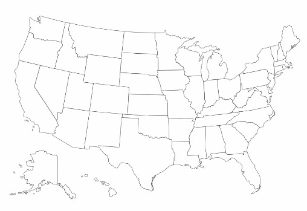

# React SVG Map USA

This package generates an interactive SVG map of USA. It allows users to highlight states on hover and retrieve the value of the selected state. The map includes all states and union territories of USA.



## Installation

Install the package via npm:

```bash
npm install react-svgmap-usa
```

## Usage

```jsx
'use client'

import { useState } from 'react'
import USAMap from 'react-svgmap-usa'

export default function MapComponent() {
    const [state, setState] = useState('')

    return (
        <>
            <div>{state}</div>
            <USAMap
                onClick={(selectedValue: string) => setState(selectedValue)}
                size='500px'
                mapColor='white'
                strokeColor='#4f4f4f'
                strokeWidth='1'
                hoverColor='#3d3d3d'
            />
        </>
    )
}
```

## Props Available

| Props       | Description                                             | Requirement | Default Value |
|-------------|---------------------------------------------------------|-------------|---------------|
| onClick     | Callback function to get the selected state value.      | Required    | NA            |
| className   | Custom classname for the map component.                 | Optional    | "svgmap"      |
| size        | Width of the map.                                       | Optional    | "inherit"     |
| mapColor    | Color of the map.                                       | Optional    | "#ffffff"     |
| strokeColor | Border color of each state.                             | Optional    | "#000000"     |
| strokeWidth | Border width of each state.                             | Optional    | "0.5"         |
| hoverColor  | Color of the state while hovering on it.                | Optional    | "#303030"     |


## Contributing

Pull requests are welcome.

## Credits

Reference of SVG map taken from [MAPSVG](https://mapsvg.com/maps).